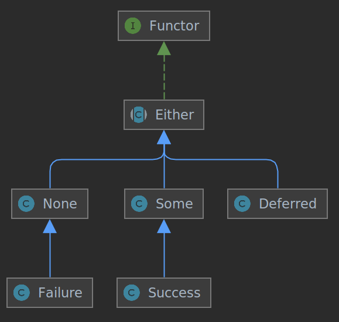

# Why

Either (inspired by the functional thing), helps to:
* Get rid of exceptions (Success/Failure).
* Discourage the use of null (None/Some).
* Simplify the control flow on errors.
* Build failsafe code
* Improve testability.

## Either

Is a supercharged version on the either monad from functional programing.

Some literature about, google for more:

https://www.thoughtworks.com/en-es/insights/blog/either-data-type-alternative-throwing-exceptions

https://itnext.io/either-monad-a-functional-approach-to-error-handling-in-js-ffdc2917ab2

https://functionalprogramming.medium.com/either-is-a-common-type-in-functional-languages-94b86eea325c

## Creating

Every either must be created using its appropriate class:

* None::create()
* Some::from($value)
* Either::do(Closure $closure)
* Success::create()
* Failure::create()

*Either::next*, *Either::orElse*, *Either::pipe*, *Either::then* and *Deferred::resolve* methods will guess the *Either* kind to be created, by the following rules:

* *Either*: A clone of the *Either*
* *Closure*: A *Deferred*
* *null*: *None*
* Otherwise: *Some*



## Either

Base class for all *Either*s

An *Either* has a *Context* that contains the *Parameters* that will use to call *Deferred* closures (if any) and a *Trail* of the evaluated *Either*s.

A new *Either* with new *Parameters* can be build by *Either::with* method, *Trail* is readonly.


### resolve(): Either

Forces an optional to be resolved, return itself but on Deferred, an *Either* from its closure execution return value is returned.

```php
// \j45l\either\Test\Unit\ExamplesTest::testDo
// \j45l\either\Test\Unit\ExamplesTest::testDoOrElse
// \j45l\either\Test\Unit\ExamplesTest::testDoOrElseFails
$either =
            Either::do($this->insertCustomer($em))->with($customer)
            // The parameters/context ($customer) is passed to orElse(), so does not need to
            // be provided again, although you could override that by using a second with().
            ->orElse($this->updateCustomer($em))
            // orElse() cause the closure from do() to be evaluated, orElse()'s closure is evaluated
            // on resolve() only when do() returns a none/failure
            ->resolve()
            // The value, either a Failure or a Success
        ;
;
```
If *resolve()* were not caller, the second closure would not be called (lazy).

### context(): Context

Returns the context of the *Either*, i.e. its trail and parameters
```php
// \j45l\either\Test\Unit\ExamplesTest::testGetContext
        $increment = static function (Some $some): Some {
            return Some::from($some->value() + 1);
        };

        $either = Some::from(42)->pipe($increment)->pipe($increment);

        $firstContextParameter = first($either->context()->parameters()->asArray());

        $this->assertInstanceOf(Some::class, $firstContextParameter);
        $this->assertEquals(43, $firstContextParameter->value());

        $this->assertCount(2, $either->context()->trail());
        $this->assertEquals([42, 43], $either->context()->trail()->getValues());
        $this->assertEquals([42, 43, 44], $either->trail()->getValues());
```

Be aware that while Either::context()->trail does not include the Either itself, Either::trail() does.
### static do(Closure $closure): Deferred

Returns a *Deferred* from *$closure* (with the current context).

```php
// \j45l\either\Test\Unit\ExamplesTest::testDo
// \j45l\either\Test\Unit\ExamplesTest::testDoOrElse
// \j45l\either\Test\Unit\ExamplesTest::testDoOrElseFails
$either =
            Either::do($this->insertCustomer($em))->with($customer)
            // The parameters/context ($customer) is passed to orElse(), so does not need to
            // be provided again, although you could override that by using a second with().
            ->orElse($this->updateCustomer($em))
            // orElse() cause the closure from do() to be evaluated, orElse()'s closure is evaluated
            // on resolve() only when do() returns a none/failure
            ->resolve()
            // The value, either a Failure or a Success
        ;
;
```

### map(Closure $closure): Deferred

Maps the *Either* value (i.e. calls *closure* with the *Either* as parameter).

Mapping a *None* results in a *None*, being the *closure* not evaluated.

Maps is from Functor, so it returns a Functor, that could be confusing when dealing with the result,
do some type assessment prior to its use, to ensure the expected type is the returned one.  

```php
// \j45l\either\Test\Unit\ExamplesTest::testMap
        $sideEffect = false;
        $increment = function (Some $number) use (&$sideEffect) {
            $sideEffect = true;
            return Some::from($number->value() + 1);
        };
        $either = Some::from(41)->map($increment); 
        
        $this->assertFalse($sideEffect); $this->assertInstanceOf(Deferred::class, $either);
         
        $either = $either->resolve(); $this->assertTrue($sideEffect);

        $this->assertInstanceOf(Some::class, $either); 
        $this->assertEquals(42, $either->value());
```

Until Either::resolve() is called, the close $increment is not invoked, so neither the value gets changed nor
the side effect occurs.

#### next($nextValue): Either

Returns an *Either* from *$nextValue* (with the current context).

#### orElse($defaultValue): Either

Returns an *Either* from *$nextValue* (with the current context) if current Either is a *None*,
 otherwise returns itself.

#### pipe(Closure $closure): Either

Returns a *Deferred* from *closure* using current Either as context parameters and using curren trail.

#### resolve(): Either

On *Deferred*, its closure is evaluated and an *Either* from the evaluation result is returned. If the closure throws a *Throwable*, a *Failure* with the *Throwable* as reason is returned

#### then($nextValue): Either

Returns an *Either* from *$nextValue* (with the current context) if the current *Either* is not a *None*, otherwise returns itself.

#### trail(): Trail

Return the trail of *Either* adding itself at the end.

#### with(...$parameters): Either

Returns a clone of the *Either* changing the parameters on its context

## Other classes

### Deferred

A deferred *Either* that must be resolved in order to its *Closure* to be evaluated (called), 
a new *Either* from the *Closure* return is returned.

### Failure

A *Failure* is a *None* used for failed operations

#### from(Reason $reason = null): Failure

Returns a *Failure* with the given *$reason*

#### reason(): Reason

Returns the *Failure* reason

### None

Absence of value, equivalent to null (but without messing with the interface)

### Some

An *Either* with a value.

When cloned, if the value is an object, it is also cloned (not a deep clone, if desired, the value itself should do so)

#### from($value): Some

Returns a new *Some* from the *$value*, never modifies nor evaluates *$value*.

#### value()

Return the value

### Success

An *Either*(*Success* with true value) to signal successful operations 

 